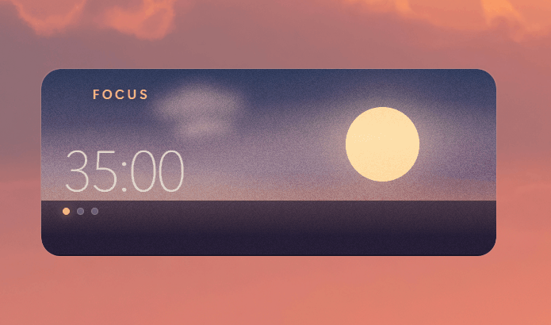
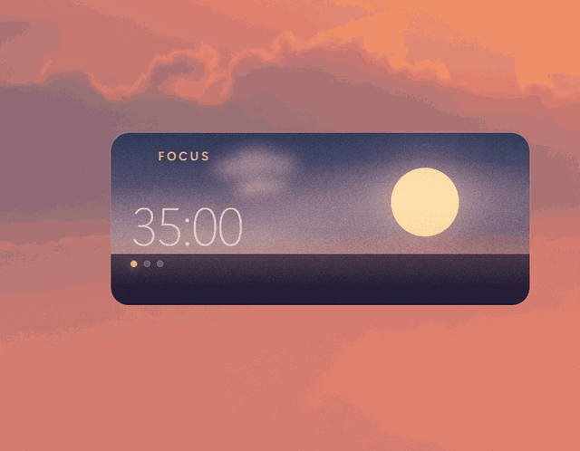
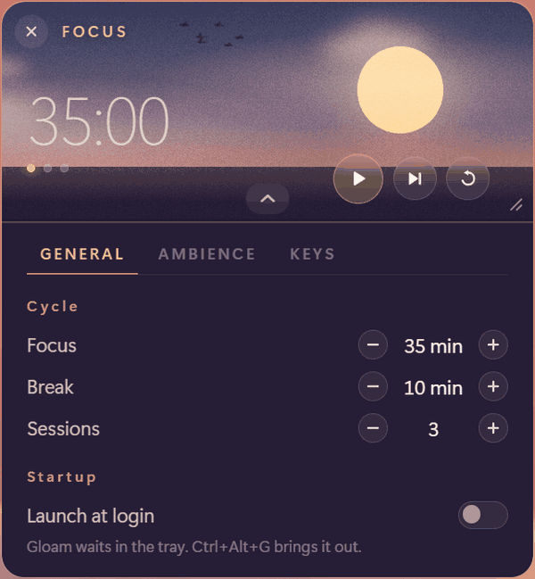
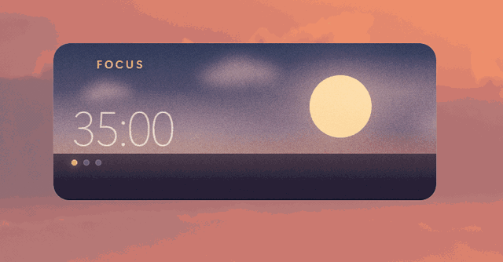

# Gloam

A floating, ambient focus timer that lives in the corner of your screen.

<p align="center">
  
</p>

<p align="center">
  <a href="https://github.com/damondrc/gloam/actions/workflows/ci.yml">
    
  </a>
</p>

Gloam is not a window you switch to. It is a small always-on-top widget that
sits on a second monitor and runs configurable focus and break intervals while
you work. Its backdrop moves through dusk as the session elapses — the sun
descends toward the horizon during focus, the moon rises during a break — so a
glance tells you roughly how much time is left before you read a single digit.

Built with **Tauri 2**, **Svelte 5** and **TypeScript**. The release binary is
a few megabytes and idles at a fraction of the memory an Electron equivalent
would need, which matters for something meant to stay open all day.

## Download

Installers are on the
[latest release](https://github.com/damondrc/gloam/releases/latest): an `.exe`
for Windows and a `.deb` for Linux.

Every release publishes a `SHA256SUMS.txt` beside them. Gloam is not
code-signed — a certificate costs more per year than this project costs to run —
so Windows will raise a SmartScreen warning the first time you run the
installer. The checksum is the honest answer to that, and it is worth checking
before clicking through:

```powershell
Get-FileHash .\Gloam_x.y.z_x64-setup.exe -Algorithm SHA256
```

```bash
sha256sum -c SHA256SUMS.txt --ignore-missing
```

---

## Why this exists

Existing Pomodoro apps fall into two camps. Some are full applications with
task lists, statistics and accounts — far more surface than a countdown needs.
Others are ambient "focus companion" experiences on Steam, which are lovely but
demand attention of their own: scenes to configure, characters to watch.

Gloam takes the middle path deliberately: the ambience is decorative and
peripheral, never interactive. There is nothing in it to fiddle with.

One small design decision that came out of using those other apps: **a break is
only ever placed between two focus sessions, never after the last one.** A
trailing break has nothing to resume into, so it is dead time.

## Features

- Frameless, transparent, always-on-top window you can drag anywhere
- Focus/break interval cycles with a plan that ends on a focus session
- An ambient sky whose state encodes progress
- Clouds that drift across it, a flock that crosses once in a long while, and
  a shooting star on a rare night
- Lock mode: dims the widget and lets clicks pass through to the window beneath
- Compact mode: double-click to shrink to the readout, play control and padlock
- Resizable from 80% to 180% by dragging the corner grip
- A settings panel that unfolds below the horizon, in three tabs: the cycle,
  what the widget is like to sit beside, and the keys
- Soft synthesised sound throughout — no audio assets, no jump scares
- A tray icon, so the widget can be put away without stopping the run — and
  found again if it ever ends up somewhere you cannot reach
- Controls stay hidden until you hover, so the widget reads as scenery

<p align="center">
  
</p>

<p align="center"><em>The controls only exist while the pointer is over the
widget. Skipping to a break swaps the sun for the moon; the padlock drops it to
44% and hands the clicks to whatever is underneath.</em></p>

### Keyboard

| Key | Action |
| --- | --- |
| `Space` | Start / pause |
| `C` | Toggle compact mode |
| `,` | Open or close the settings panel |
| `+` / `-` | Scale the widget up or down |
| `Ctrl+Alt+G` | Toggle lock, from anywhere |

A short list on purpose. A key is bound only if what it does is reversible,
cheap to undo, and reachable some other way — so skipping, resetting and
locking are buttons rather than letters. Gloam sits on top of everything and
can hold the keyboard focus without you thinking of it as the application you
are in, and a window like that should not be able to discard a session because
a letter was typed at it.

Lock keeps `Ctrl+Alt+G`: modified, so it cannot be hit by accident, and
registered globally, so it still works when the widget cannot be clicked —
which is the one situation an escape hatch is for.

## Lock mode

An always-on-top widget is easy to live with on a second monitor and awkward on
a single one, where it covers the document you are reading and intercepts
clicks meant for it. Clicking the padlock turns the whole window click-through,
so the mouse passes straight to whatever is underneath, and drops the widget to
44% opacity so it reads as a watermark.

The interesting part is getting back out. Click-through is a whole-window
property — no platform exposes "pass everything through except this button" —
so Gloam does the hit-testing itself. While locked it polls the global cursor
position every 70 ms and compares it against the padlock's rectangle in screen
coordinates. When the cursor enters, click-through is switched off so the click
can land; when it leaves, it goes back on. The padlock behaves like a hole in
an otherwise pass-through surface.

Two known consequences:

- While the cursor is inside the padlock's rectangle the entire window is
  briefly clickable again, so a click a few pixels outside the padlock is
  swallowed rather than passed through. The hotspot is kept small to limit it.
- Polling costs one IPC round trip every 70 ms, and only while locked.

`Ctrl+Alt+G` is registered in Rust as a safety net: if hit-testing ever fails
on an unusual window manager, the widget is still recoverable. If another
application already owns that shortcut, registration fails quietly and the
padlock keeps working.

Locking hides the close button, so the widget cannot be quit until it is
unlocked. That makes the escape hatch load-bearing, and Gloam states it rather
than leaving it to be discovered: a hint naming the shortcut appears for a few
seconds every time you lock.

For the same reason only one copy may run at a time. Two would be worse than it
sounds — the window opens at a fixed position, so a duplicate lands exactly on
top of the original and reads as one widget misbehaving, and since only one
process can hold a global shortcut, the second copy silently loses its way out.
Launching again surfaces the running instance instead of starting another.

Lock is not remembered between runs, unlike scale and compact mode. It is a
mode rather than a preference, and it is the one mode in which the widget
accepts almost no input — booting into it means any failure in the
click-through path hands the user a window they cannot interact with. A wrong
saved scale is merely ugly; a wrong saved lock is a trap. Gloam always starts
interactive.

Because click-through is write-only — nothing reports back whether the call
took effect — the controller restates its intent every ten polls rather than
only on transitions, so a dropped call heals itself within a second.

## Scale

Dragging the grip in the bottom-right corner resizes the widget between 80% and
180%. Everything scales together — type, buttons, the sun, the spacing — because
sizes throughout the stylesheet are written in `rem`, and the root font size is
one design pixel multiplied by the current scale. Changing one custom property
therefore relays out the entire widget, and because it is a real relayout rather
than a transform, text stays crisp at every size.

Scale is kept independent of the other two size-ish concepts on purpose:

| Axis | Question it answers | Control |
| --- | --- | --- |
| Scale | How big is everything drawn? | Corner grip, `+` / `-` |
| Layout | Which elements exist? | Double-click for compact |
| Panels | How much content is there? | The chevron, `,` |

Folding these into a single "size" control is tempting and wrong: dragging to
enlarge the clock would also unfold the settings, and collapsing them would
shrink your type.

The window is declared non-resizable, and `setWindowSize` opens that flag for
the length of one resize before closing it again. The dance is not decoration:
the two platforms read the same flag differently.

Windows takes it to mean "the user may not drag the edges" and still honours
programmatic resizing. GTK takes it to mean "this window has one size" and
ignores every later resize request, including the app's own — with it simply
set to false, the Linux build kept its startup size forever. Set to true
instead, the window manager advertises an invisible resize border and swaps the
cursor for it all around the widget, and a hand-resized window desyncs from the
widget drawn inside it, since the frame carries its own dimensions.

Pinning the minimum and maximum is not enough on its own: a window manager may
still offer the grip it will then refuse. So the flag stays shut except for the
instant a resize needs it.

## Settings

The chevron on the bottom edge unfolds a panel below the horizon. That
placement is deliberate: the sky is the timer, the ground is where the
machinery lives. Controls laid over the gradient would be hard to read and
would break the one idea the backdrop carries.

<p align="center">
  
</p>

It is split into two tabs, answering two questions: **General** is how long a
run is and whether the machine opens Gloam by itself, **Ambience** is what the
widget is like to sit beside — its volume, the material it sounds like, how
alive the sky is and what the horizon is.

### Launch at login

Under Startup, in General. Gloam registers itself with the session and starts
**in the tray** rather than on screen. A widget is something you reach for, and
a session manager is not a person reaching: arriving on top of a desktop that
is still assembling itself is an interruption, which is the one thing this app
exists in order not to be. The tray icon or `Ctrl+Alt+G` brings it out.

Where no tray could be created it opens on screen instead, because starting
hidden with nothing to bring it back is starting lost. The line under the
switch says which of the two this machine will do, rather than leaving it to be
discovered by rebooting.

This is the only setting Gloam does not store with the others, and it is
deliberate: it does not belong to Gloam. It is a registry value under `Run` on
Windows and a `.desktop` file in `~/.config/autostart` on Linux, and either can
be removed by Task Manager or a startup applications dialogue while the widget
is running. A remembered copy would eventually be a switch that is confidently
wrong, so the panel asks the platform at launch — and after a change, reads
back what actually happened rather than assuming the write succeeded. A managed
machine that refuses it leaves the switch where it was.

There were three for a while, with sound and the backdrop kept apart. They were
apart because they were built at different times, not because anyone choosing
between them thinks of them as different: both are the answer to how much of
itself the widget should make you aware of. Reuniting them cost one tab and
left the panel describing the widget instead of its history.

Tabs at all, rather than one column, because stacked the sections run past 280
design pixels — at 180% scale, most of a laptop screen. The tab is navigation
rather than preference, so it is not remembered.

Durations are steppers rather than number fields. At this size a form input
looks borrowed from another application, and more usefully a stepper cannot
produce an invalid value — there is no empty state and nothing to mistype. They
freeze while the timer runs, so a stray click cannot discard a session; when
the run is paused part-way the panel says that applying a change will restart
it, rather than letting the cost be discovered.

### Sound

Everything is synthesised. No audio files means nothing to license, nothing to
decode, no binaries in the repository, and a timbre that stays editable as code.

The module splits along one line: an *instrument* decides how a single note
sounds, a *phrase* decides which notes and in what order. That split is why
adding either is a function rather than a redesign.

What the panel offers is a *set*: an instrument, a phrase and a kit of button
sounds, picked together and named for their material.

| | |
| --- | --- |
| **Bowl** | The widget's own voice. Warm, two notes, slow to fade. |
| **Bell** | Metal, announced in three notes. Hard to miss. |
| **Felt** | Wood and felt, fading into itself. Barely there. |

They come together because the material has to be common — and because
separate controls for the alarm and the buttons are, in practice, a tool for
breaking that. Three settings offering forty-eight combinations is not more
choice than three sets; it is the same choice with the coherent answers hidden
among the incoherent ones. Each set answers one question instead: how it
sounds when nobody has asked for anything, what to reach for when a transition
keeps being missed, and what is left when it should barely register.

Three instruments, three phrases, three kits of buttons, and each set uses
exactly one of each.

Whatever the pattern, the two transitions are always the same material in
opposite directions: rising into focus, falling into a break. Identical notes
make them audibly a pair, opposite direction makes them impossible to confuse,
and direction was chosen over register because it survives being half-heard —
which is the condition these play under. The end of a run is a fuller chord,
marking an ending rather than a change.

Button sounds were first designed around what different speakers can reproduce,
which turned out to be the wrong question — a recommendation mistaken for a
rule. The right one is what this widget sounds like: soft attacks, some warmth,
no digital edges. Every kit keeps the same grammar, so the meaning survives
changing the material — start rises, pause falls, reset is neutral, locking
falls shut and unlocking springs open.

There is no way to silence the buttons alone, deliberately. Feedback you cannot
hear is a button you are not sure you pressed, and muting is what the volume
control is for.

Every gesture fades out whatever is still ringing before it starts. Auditioning
a setting is the reason: you are there to hear the thing you picked, not the
thing you picked over the last two.

### The backdrop

Clouds drift across the sky in three banks, taking six to eight minutes to
cross. Their colour is interpolated from the same keyframes as everything else,
so they are lit by the moment: cream at golden hour, dull violet at dusk,
near-silhouettes once night falls. They render above the sun, so a bank
crossing it dims it — that occlusion is most of what separates a cloud from a
smudge.

A flock crosses once every four to nine minutes and is gone in fifteen seconds.
The birds are a twelve-frame flipbook rather than a rotating shape, which is
the whole animation: swapping silhouettes lets the wing change shape as well as
angle, so it extends through the downstroke, folds on the recovery, and its
tips curl upward as it rises. A wing that keeps its length reads as a
windscreen wiper. Every crossing rolls its own duration, flock size, height and
descent, and each bird holds its own pace within the group, so the formation
changes shape on the way across and no two crossings are alike.

The flock is damped against the widget's scale rather than tracking it: making
the window bigger should reveal more sky, not larger birds.

Three modes, under **Backdrop** in the panel, answering three different
questions rather than being three degrees of one:

| | |
| --- | --- |
| **Full** | Clouds and the occasional flock. |
| **Calm** | Clouds only. Nothing crosses quickly. |
| **Light** | A flat sky, for a modest machine. |

*Calm* is about attention. *Light* is about a laptop's battery, so it drops
what actually costs something — blurred surfaces and per-frame animation —
rather than what merely looks busy; the birds are unrendered rather than
hidden, which stops their scheduler too. A fourth mode sat between the two for
a while, with one unblurred cloud bank and nothing else, but blur is what makes
a cloud a cloud, so all it did was leave a shape on the sky. A mode has to be a
coherent thing to want rather than a point on a slider.

The sky, the horizon and the grain are never touched by any of them. They are
the widget's face rather than its ambience.

## The horizon

**Horizon**, in the same tab, chooses what the bottom of the widget *is* —
not something standing on the flat band, but the band itself.

| | |
| --- | --- |
| **Water** | A flat band. What Gloam has always looked like. |
| **Skyline** | A city, lighting up as the sky goes dark. |
| **Ridge** | Three ranges at three distances. |

Replacing rather than covering is half of it. A silhouette drawn above the
band with the band still showing underneath reads as two pictures stacked; the
mass has to reach the bottom edge of the frame and have the silhouette for its
top edge, with no line across it, before it reads as one place.

The other half is that all of it — ground and silhouette together — stays
inside the last quarter of the frame. The sky is the clock, so the sky is what
has to dominate; a horizon reaching halfway up is a landscape with a countdown
in it rather than a countdown with a horizon. Everything else is carved out of
that quarter: how tall a tower may be, how much relief a range gets. Compact
keeps whichever horizon was picked, at the same proportion of a shorter frame,
which turns the city into a low profile rather than dropping it.

All three take the same quarter, from one number the widget publishes to the
stylesheet, so switching between them does not move the skyline up and down.
The water band used to be taller than the other two, which made it read as the
heavy option rather than as the plain one.

The shooting star's reflection belongs to the water and goes with it. A streak
crossing the sky is the sky's; the smear it leaves along the surface below is
the surface's, and a glow rising out of a rooftop is a reflection of nothing.
The streak still crosses whichever horizon is up.

The ranges are opaque, and their distance is a colour the sky mixes rather
than a transparency. Fading a far ridge instead is cheaper and looks
plausible until the moon rises behind it — a mountain you can see the moon
through is not a mountain.

The city is the one that does something. Each window carries a threshold and
comes on when the night passes it, so the lights appear across a focus
session as the sun goes down, fill in through a break, and go out again when
the sun comes back up for the next one. The same clock the sky is already
keeping, read a second way, and it costs nothing: one comparison in the
stylesheet against a custom property the sky publishes anyway. Nothing here
animates, which is why it stays even in **Light**.

A window switches rather than fades, at its own brightness — somebody reached
for a lamp. An earlier version eased each one in over a sixth of the run,
which looked less like a city coming on than like a dimmer being turned up on
all of it at once. About a fifth never light at all and roughly one in eight
burns day and night, because a grid that fills in completely stops being a
city and becomes a spreadsheet, and a city with every light off at dusk is one
nobody lives in. The whole facade is glazed, roof to pavement: lights gathered
near the roofs read as a strip rather than as buildings.

Neither shape is drawn. Both are generated from a fixed seed at build time —
a skyline that rearranged itself between launches would be the opposite of
ambient, so the seed is authorship rather than variety, and the repository
carries no artwork it would otherwise have to license.

## Compact mode

Double-clicking collapses the widget to a single row: the readout, the play
control and the padlock. Skip, reset and close are dropped rather than shrunk —
below about 24px a button stops being worth aiming at — and stay available on
the keyboard. Double-clicking again restores the full widget.

<p align="center">
  
</p>

<p align="center"><em>Compact mode and the scale range are separate axes: one
decides how much the widget shows, the other how big it is.</em></p>

## Where it lives

The first time it opens, Gloam settles into the bottom right of the screen at
150%, inside the usable area rather than behind the taskbar and with room below
for the panel to unfold into. Big enough to read at a glance from across the
desk, which is the whole point of it, and well inside the scale range either
way.

After that it remembers where you left it. The position is written down once the
window has been still for a moment — a drag reports every step of the pointer,
and the places it passed through are not where it was left — and applied again
at the next launch before anything has been drawn into the window, so the
widget appears in place rather than jumping there.

A remembered position is a suggestion rather than an instruction. It is only
good for the arrangement of screens it was recorded on, and unplugging a
monitor is an ordinary thing to do to a laptop, so at startup it is checked
against the screens actually attached: enough of the widget has to fall on one
of them, in both directions, to be seen and grabbed. Both directions on the
*same* screen — a window in the corner between a wide monitor and a tall one
can overlap each of them generously and be visible on neither.

When the check fails nothing happens and the window opens where it always
does. Nudging it to the nearest valid spot was the alternative and is worse: a
corner you can predict beats a position arithmetic chose for you.

## The tray

Closing the widget hides it. The run carries on, and the tray icon brings it
back. Quitting for real is the last entry in its menu.

The menu's first entry is a toggle, and says which way it will go: `Hide Gloam`
while the widget is out, `Show Gloam` while it is away. One entry rather than
two, of which one would always be wrong.

On Windows a left click on the icon does the same thing without opening the
menu. On Linux it does nothing, and that is not something Gloam can fix — the
AppIndicator protocol that Linux trays speak has no notion of a click on an
icon. It offers a menu, which is why the menu carries both directions.

The middle entry is the reason the tray exists. A frameless window that stays
on top can be dragged somewhere unhelpful, left on a monitor that is later
unplugged, or hidden behind its own lock mode, and none of those has a way out
from inside the widget. `Reset position` is the way out. It centres the window
rather than returning it to the corner it starts in, because that corner is
itself a position which may no longer exist — a changed monitor layout is the
whole failure being recovered from, and the middle of the primary display is
the one place that is always there.

Nothing else goes in the menu. The tray is an escape hatch, not a second copy
of the interface: a start button in there would be a control with none of the
widget's own language around it, in a place the widget cannot draw.

Some desktops have no tray, and several Linux environments ship with it turned
off. When the icon cannot be created Gloam says so on stderr and closing goes
back to meaning quit, since hiding into something that does not exist is how a
window gets lost. The close button's tooltip says which of the two it is about
to do.

## Running it

Requires [Node.js](https://nodejs.org) 18+ and the
[Rust toolchain](https://rustup.rs). On Windows you also need the
**Desktop development with C++** workload from the Visual Studio Build Tools.

```bash
npm install
npm run app        # development build with hot reload
npm run app:build  # produce an installer in src-tauri/target/release/bundle
```

The frontend runs standalone in a browser too, which is convenient for
iterating on the visual layer without a Rust rebuild:

```bash
npm run dev        # then open http://localhost:1420
```

All Tauri calls are guarded, so the widget degrades gracefully outside the
desktop shell.

### Tests

```bash
npm test           # once
npm run test:watch # on every save
```

Everything CI will run, before it runs it:

```bash
npm run check        # types, across TypeScript and Svelte
npm test
npm run rust:fmt     # add --check to ask rather than apply
npm run rust:lint    # clippy, warnings are errors
```

The Rust ones go through npm rather than cargo so they can be run from the
project root like everything else, and so that CI and a person about to push
are running the same string out of the same file.

The suite covers the parts where being wrong would be invisible: the plan
builder, the duration formatter, the settings clamp, the timer engine, the
validation applied to stored preferences, the keyboard bindings, whether a
remembered window position is still on a screen, and the arithmetic that
decides whether the cursor is over the padlock.

A misplaced button is obvious. A seven-session run with six breaks instead of
five is not. Neither is a pause that loses forty milliseconds, a transition
that chimes twice, a hotspot six pixels out on a second monitor, or a
preferences file that quietly stops the widget opening at all.

That boundary is the point rather than a shortcut. The window, the
click-through and the layout are where every bug in this project has actually
lived, and they are also where automated tests are expensive, fragile and need
a real desktop to run against — so what gets tested is what can be asked a
question by a function call.

Some of it had to be moved before it could be asked anything. The key bindings
were a `switch` inside a component and the hit-test was four lines behind two
IPC round trips; both are now plain modules that take values and return an
answer.

The tests assert rules rather than examples, running the same checks across a
spread of configurations, so what they protect is "a plan always alternates and
never ends on a break" rather than "with these numbers it comes out like this".

What no test covers is the window itself — always-on-top, click-through,
resizing, trays, and the different opinions Windows and GTK hold about all
four. Those need a desktop and a person, so they are a written checklist
instead: [docs/platform-testing.md](docs/platform-testing.md). It is run before
any release that changed how the window behaves, and a row nobody ran counts as
a row that failed.

The automated ones are checked the same way anything else is: by breaking the
code on purpose and confirming they notice. That is how the pause tests were found to be
worthless — they paused on a whole number of ticks, where the tick that had
just run already held the right answer, so a pause that captured nothing still
looked correct. Fifty milliseconds off the grid, and they mean something.

## Platform support

| | Status |
| --- | --- |
| Windows 10/11 | Supported — verified against 0.6.0 |
| Linux · X11 | Supported — verified against 0.6.0 |
| Linux · Wayland | Not tested |
| macOS | Never run |

Linux packages are built inside an Ubuntu 22.04 container, and run on **Ubuntu
22.04, Debian 12 and Mint 21** or newer. A `.deb`, and nothing else: the
AppImage was withdrawn after two attempts at making it play sound, and a silent
alarm looks exactly like a working one.

The rows above say what somebody checked on a real machine, from
[the checklist](docs/platform-testing.md) that gets run before a release.
Where nobody has run it, they say that instead of guessing.
[docs/open.md](docs/open.md) lists what is still to be looked at, so nothing
that was promised gets quietly dropped.
[docs/platforms.md](docs/platforms.md) has the detail: what Wayland is expected
to do and why nobody has watched it do it, how far back a Linux build reaches
and what decides that, and the two things about dragging and resizing on Linux
that are the window manager's rather than Gloam's.

## Roadmap

Everything here is built on one rule: **the default state never gets busier.**
Anything new arrives as something you expand into, so a Gloam with every
setting turned on still looks like the screenshot above until you ask it for
more. Growth goes into disclosure, not into the resting state.

What is left before 1.0 is mostly not features. The timer works; what Gloam has
been missing is everything around it — remembering where it lives, being
impossible to lose, and being verifiable by someone who is not holding the
laptop it was built on.

**Done**

- [x] The widget: frameless, always-on-top, an ambient sky that encodes progress
- [x] Lock mode with cursor hit-testing, compact mode, persisted preferences
- [x] A scale factor and a corner grip, so later panels grow inside a container
      that already knows how
- [x] The settings panel: durations, session count, alarm timbre and button
      feedback, with the timer's rules under test
- [x] A living backdrop: clouds, a rare flock, a rarer shooting star, and three
      ambience modes
- [x] CI on every push, and a release built, checksummed and drafted by tag

**0.6.0 — the widget stays where you put it**

- [x] A tray icon: show, reset the position, quit. Closing hides rather than
      exits, so the widget cannot be lost by clicking the wrong thing.
- [x] The window position remembered between runs, and checked against the
      monitors that actually exist at startup rather than the ones that did
- [ ] The countdown correct while the window is hidden, not only while it is
      being watched
- [ ] The timer engine, the preference validation and the hit-test arithmetic
      under test — the places where being wrong would be invisible

**0.7.0 — polish, if it earns its place**

- [x] A one-time tour on first run, so the sky, dragging and the padlock are
      discovered rather than read about
- [x] The shortcuts listed inside the app
- [x] Launch on startup — into the tray, and read from the system rather than
      remembered
- [x] An alternative horizon or two — a city skyline whose windows light up as
      the sun goes down — as one row in the backdrop tab

**1.0.0 — the declaration**

No new code. The README split into documentation that suits someone using
Gloam and documentation that suits someone reading it, a contributing guide
that states the bar a feature has to clear, a security policy, and a platform
checklist that has actually been run rather than assumed. The version people
judge a project by should be the one with the least left to go wrong.

### Deliberately not on this list

- **Statistics, history, streaks.** The second paragraph of this README says
  what Gloam is not, and a dashboard is the shortest path to becoming it.
- **A scene *editor*.** A skyline is worth having. A mode for arranging one,
  inside a 320-pixel window, is not.
- **Notifications.** The widget is already on screen, and a notification is
  precisely the interruption it exists in order not to be.
- **Accounts, sync, anything networked.** Gloam opens no connections at all.
  That is worth more than any feature which would end it.

### After 1.0

- `gtk-layer-shell`, if enough people turn out to be on a compositor that
  implements the protocol GNOME does not.
- Ambient music from a local folder. It would be the heaviest subsystem in the
  project, the only one nothing else depends on, and a transport with a track
  name on it is a thing to fiddle with — which is the argument this README
  opens with. Last on purpose, and not certain.

### A note on motion

The eye detects movement in peripheral vision far better than it detects detail
or colour — which is exactly the hazard for an app whose whole purpose is to not
take your attention. Ambient motion here is therefore governed by one rule:
**continuous motion must be too slow to trigger that reflex, and anything fast
must be rare.** Clouds drift slowly enough that you only notice they moved by
comparing two moments. Birds cross once every several minutes, which turns them
from noise into something you catch by chance and enjoy. Scarcity is what makes
them work.

## Project layout

```
src/
  App.svelte          composition and layout of every visual layer
  lib/
    plan.ts           the timer's pure logic, and the only tested code
    plan.test.ts      its rules, asserted across many configurations
    timer.svelte.ts   the reactive state and the countdown
    shortcuts.ts      what each key means, and who else claims it
    placement.ts      whether a remembered position is still reachable
    lock.svelte.ts    click-through and cursor hit-testing
    hitbox.ts         CSS pixels to desktop pixels, for the padlock
    scale.svelte.ts   the scale factor and its drag interaction
    sky.ts            the palette, keyframes and interpolation
    ambience.ts       what each backdrop mode switches off
    horizon.ts        the skyline and the ridge, generated from a seed
    sound.ts          instruments and phrases, all synthesised
    prefs.ts          persisted preferences, validated on the way in
    window.ts         guarded wrappers over the Tauri window API
    Stars.svelte      fixed star field
    Clouds.svelte     drifting banks
    Birds.svelte      the flock, and when it flies
    birdFrames.ts     its twelve silhouettes, generated
    Horizon.svelte    what stands on the far shore
    Grain.svelte      generated film grain
    Controls.svelte   transport buttons
    Padlock.svelte    the animated lock
    Grip.svelte       the corner resize handle
    Panel.svelte      the settings panel below the horizon
    Stepper.svelte    minus/value/plus row
    Cycler.svelte     one-of-a-short-list row
    Toggle.svelte     on/off row
    autostart.ts      the startup entry, asked for rather than remembered
src-tauri/            Rust shell, window configuration, global shortcut
scripts/              version and changelog checks, used by CI
.github/workflows/    checks on every push, a release on every tag
docs/media/           the stills and GIFs in this file
```

## License

MIT — see [LICENSE](LICENSE).
