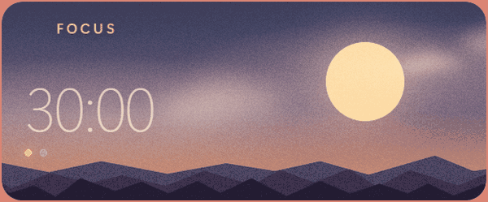
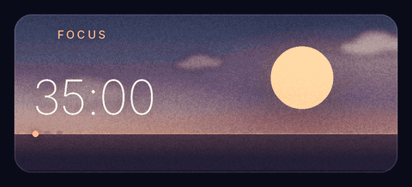
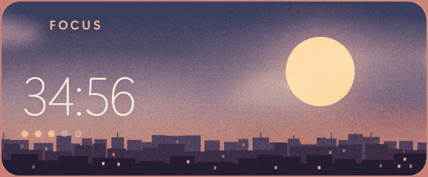
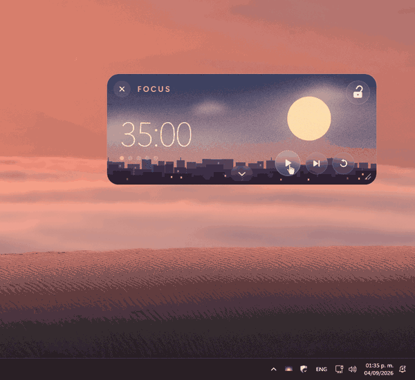
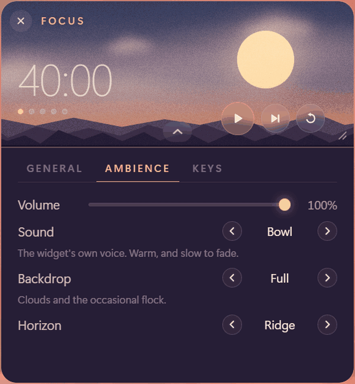

# Gloam

A floating, ambient focus timer that lives in the corner of your screen.

<p align="center">
  
</p>

<p align="center">
  <a href="https://github.com/damondrc/gloam/releases/latest">
    
  </a>
  <a href="https://github.com/damondrc/gloam/actions/workflows/ci.yml">
    
  </a>
  <a href="LICENSE">
    
  </a>
</p>

Gloam is not a window you switch to. It is a small always-on-top widget that
sits in the corner of a monitor and runs focus and break intervals while you
work. Its backdrop moves through dusk as the session elapses — the sun descends
toward the horizon during focus, the moon rises during a break — so a glance
tells you roughly how much time is left before you read a single digit.

The ambience is decorative and peripheral, never interactive. There is nothing
in it to fiddle with, which is the entire point: most focus apps are either a
task manager with a countdown attached or a scene that wants watching, and both
are something else to attend to.

## Download

Installers are on the
[latest release](https://github.com/damondrc/gloam/releases/latest) — an `.exe`
for Windows and a `.deb` for Linux — with a `SHA256SUMS.txt` beside them.

Gloam is not code-signed, so Windows raises a SmartScreen warning the first
time you run the installer. The checksum is the honest answer to that, and it
is worth a moment before clicking through:

```powershell
Get-FileHash .\Gloam_x.y.z_x64-setup.exe -Algorithm SHA256
```

```bash
sha256sum -c SHA256SUMS.txt --ignore-missing
```

## What it does

<p align="center">
  
</p>

<p align="center"><em>A focus session and the break after it, at about two
hundred times speed — the only way to watch in one glance what normally takes
forty-five minutes. The clock is the only thing hurrying: the clouds, the
flock and the twinkle run at the speed they really run at, which is the
distance between an ambient backdrop and a busy one.</em></p>

- **The sky is the progress bar.** The sun sinks while you focus and the moon
  rises while you rest, so the time left is readable without reading.
- **Focus and break cycles you set**, with a plan that ends on a focus session.
  A trailing break has nothing to resume into, so it is dead time.
- **A choice of horizon** — open water, a city whose windows come on as the sky
  goes dark, or a mountain ridge. Generated rather than drawn.
- **Clouds, a rare flock, a rarer shooting star.** Continuous motion is slow
  enough not to catch your eye; anything quick is scarce enough to be a
  pleasure rather than a distraction.
- **Lock mode** dims the widget to a watermark and lets clicks pass straight
  through to whatever is underneath.
- **Compact mode** folds it to a single row, and the corner grip scales the
  whole thing from 80% to 180%.
- **A tray icon**, so it can be put away without stopping the run — and found
  again if it ends up somewhere you cannot reach.
- **Soft synthesised sound**, no audio files and no jump scares.
- **Opens with your session** if you ask it to, into the tray rather than onto
  your screen.
- **No accounts, no network, no statistics.** Gloam opens no connections at all.

## Using it

Drag it from anywhere on its face — there is no title bar. The controls appear
when the pointer is over the widget and disappear again when it leaves, so at
rest it reads as scenery.

| Key | Action |
| --- | --- |
| `Space` | Start / pause |
| `C` | Toggle compact mode |
| `,` | Open or close the settings panel |
| `+` / `-` | Scale the widget up or down |
| `Ctrl+Alt+G` | Toggle lock, from anywhere |

A short list on purpose: a key is bound only if what it does is reversible and
reachable another way, so skipping, resetting and locking are buttons. Gloam
sits on top of everything and can hold the keyboard focus without you thinking
of it as the app you are in, and a window like that should not be able to
discard a session because a letter was typed at it.

### Lock mode

<p align="center">
  
</p>

<p align="center"><em>The text underneath is being selected through the widget.
That is the whole feature: the padlock is the one hole left in an otherwise
pass-through surface.</em></p>

An always-on-top widget is easy on a second monitor and awkward on a single
one, where it covers what you are reading. The padlock hands every click to the
window beneath and drops Gloam to a watermark — except on the padlock itself,
so there is always a way back. `Ctrl+Alt+G` works from anywhere as a second
one.

### Compact mode

<p align="center">
  
</p>

Double-clicking collapses the widget to the readout, the play control and the
padlock. Skip, reset and close are dropped rather than shrunk — below about
24px a button stops being worth aiming at — and stay on the keyboard.

### The tray

<p align="center">
  
</p>

<p align="center"><em>The clock is the thing to watch. It reads 35:00 before
the widget is put away and 34:43 when it comes back — the run never stopped,
it was only out of sight.</em></p>

Closing hides the widget and the run carries on. `Reset position` brings it
back to the corner it lives in, which is the way out of having dragged it
somewhere unhelpful or left it on a monitor that is no longer plugged in.
Quitting for real is the last entry.

Some desktops have no tray, and several Linux environments ship with it turned
off. Where the icon cannot be created, closing goes back to meaning quit — and
the close button's tooltip says which of the two it is about to do.

## Settings

The chevron on the bottom edge unfolds a panel below the horizon: the sky is
the timer, the ground is where the machinery lives.

<p align="center">
  
  
</p>

| Tab | |
| --- | --- |
| **General** | How long a run is, and whether the machine opens Gloam by itself. |
| **Ambience** | What the widget is like to sit beside: volume, the material it sounds like, how alive the sky is, and what the horizon is. |
| **Keys** | Every shortcut, and the way back to the tour. |

**Sound.** Three sets, each an instrument, a phrase and a kit of button sounds
picked together and named for their material.

| | |
| --- | --- |
| **Bowl** | The widget's own voice. Warm, two notes, slow to fade. |
| **Bell** | Metal, announced in three notes. Hard to miss. |
| **Felt** | Wood and felt, fading into itself. Barely there. |

**Backdrop.** Three modes, answering three different questions rather than
being three degrees of one.

| | |
| --- | --- |
| **Full** | Clouds and the occasional flock. |
| **Calm** | Clouds only. Nothing crosses quickly. |
| **Light** | A flat sky, for a modest machine. |

**Horizon.** What the bottom quarter of the widget is, rather than something
standing on it.

| | |
| --- | --- |
| **Water** | A flat band. What Gloam has always looked like. |
| **Skyline** | A city, lighting up as the sky goes dark and out again through the break. |
| **Ridge** | Three ranges at three distances. |

**Launch at login** starts Gloam in the tray rather than on screen: a widget is
something you reach for, and a session manager is not a person reaching. On a
desktop with no tray it opens on screen instead, and the line under the switch
says which of the two you will get.

## Where it opens

The first time, bottom right at 150% — inside the usable area rather than
behind the taskbar, and big enough to read at a glance from across the desk.
And it introduces itself once: four steps, each of which can be followed while
it is being described, and then never again unless you ask for it from the Keys
tab.

After that it remembers where you left it, and checks that position against the
screens actually attached before using it — unplugging a monitor is an ordinary
thing to do to a laptop.

## Platform support

| | Status |
| --- | --- |
| Windows 10/11 | Supported — verified against 0.6.0 |
| Linux · X11 | Supported — verified against 0.6.0 |
| Linux · Wayland | Not tested |
| macOS | Never run |

These rows say what somebody checked on a real machine, from
[a written checklist](docs/platform-testing.md) that is run before a release.
Where nobody has run it, they say that instead of guessing.

Linux packages are built inside an Ubuntu 22.04 container and are expected to
run on **Ubuntu 22.04, Debian 12 and Mint 21** or newer. A `.deb`, and nothing
else for now: Fedora, openSUSE and Arch have no package yet, and
[getting one to them](docs/open.md) is on the list rather than half-done.

## Built with

**Tauri 2**, **Svelte 5** and **TypeScript**. The release binary is a few
megabytes and idles at a fraction of the memory an Electron equivalent would
need, which matters for something meant to stay open all day.

Everything new arrives as something you expand into: **the default state never
gets busier.** A Gloam with every setting turned on still looks like the
recording at the top of this page until you ask it for more.

Deliberately absent, and staying that way — statistics and streaks, a scene
editor, notifications, and anything networked.

## Read more

| | |
| --- | --- |
| [How it works](docs/architecture.md) | The decisions, and what they ruled out. Click-through, the scale system, the sound design, the generated horizons, and what is tested and why. |
| [Contributing](CONTRIBUTING.md) | How to build it, and the bar a feature has to clear. |
| [Security](SECURITY.md) | What Gloam does not do, and how to report something. |
| [Platforms](docs/platforms.md) | What each platform is known to do, and how that is known. |
| [Open threads](docs/open.md) | Everything the project has said it would come back to. |
| [Changelog](CHANGELOG.md) | What changed, release by release. |

## Licence

MIT — see [LICENSE](LICENSE).
